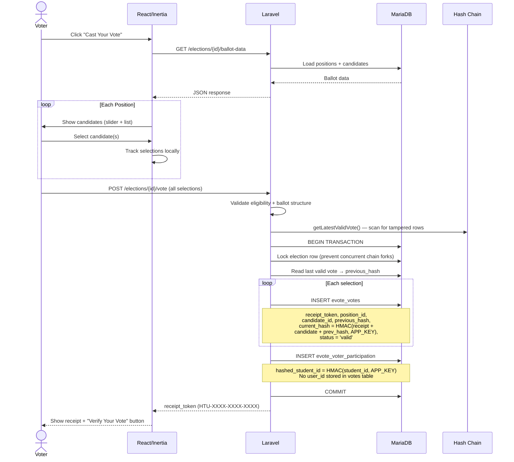
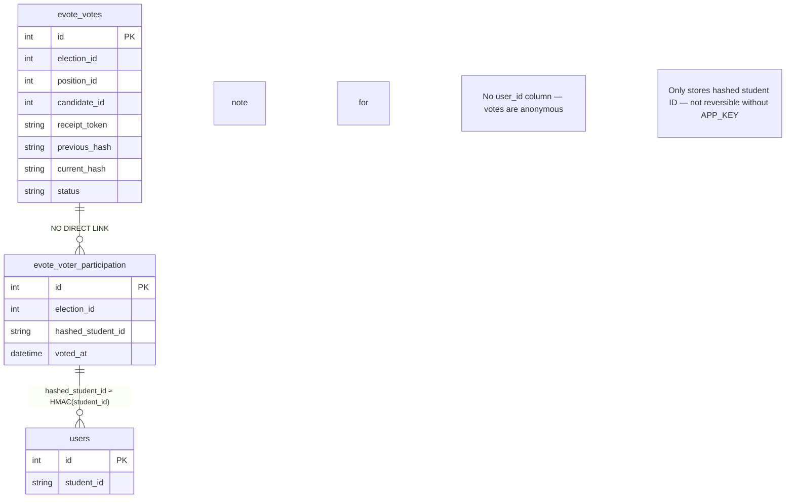

# Voting Architecture

## Flow



## Anonymity



## Hash Chain Integrity

```mermaid
flowchart LR
    subgraph Genesis
        G[Genesis Block]
    end

    subgraph Vote1
        V1[Vote #1<br/>President]
        H1[curr_hash = HMAC<br/>(receipt + candidate<br/>+ prev_hash, APP_KEY)]
    end

    subgraph Vote2
        V2[Vote #2<br/>Vice President]
        H2[curr_hash = HMAC<br/>(receipt + candidate<br/>+ prev_hash, APP_KEY)]
    end

    subgraph Vote3
        V3[Vote #3<br/>Secretary]
        H3[curr_hash = HMAC<br/>(receipt + candidate<br/>+ prev_hash, APP_KEY)]
    end

    G -->|"prev_hash"| H1
    H1 -->|"prev_hash = H1"| H2
    H2 -->|"prev_hash = H2"| H3

    note for V2 "Tamper with Vote #2<br/>→ H3's prev_hash ≠ H2<br/>→ Chain breaks<br/>→ Auto-quarantined"
```

## Verify Vote

```mermaid
flowchart LR
    V[Voter] -->|Paste receipt| P[Verify Page<br/>GET /verify?token=HTU-...]
    P -->|"EXISTS query"| DB[(evote_votes)]
    DB -->|found + valid| P
    P -->|"✅ Vote Verified<br/>Election: SRC 2026<br/>No ballot choices shown"| V
    note for P "Only confirms existence + validity<br/>Never reveals candidate choices"
```
