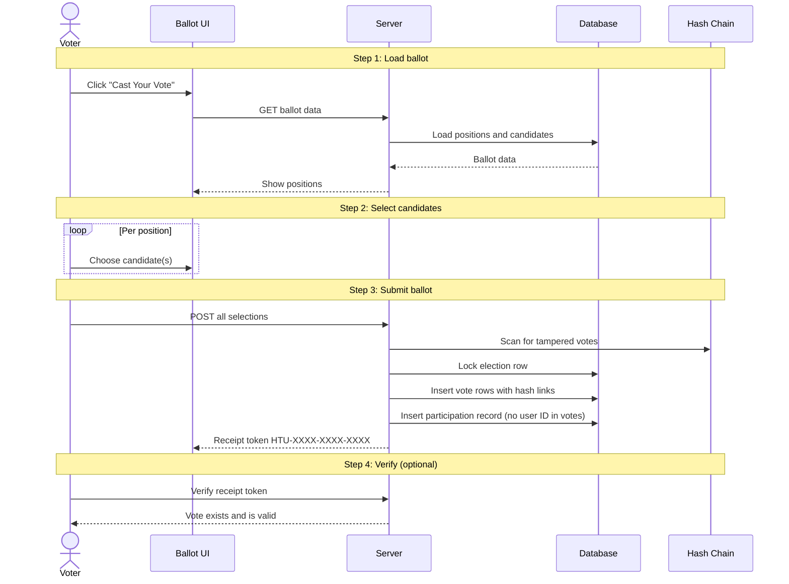
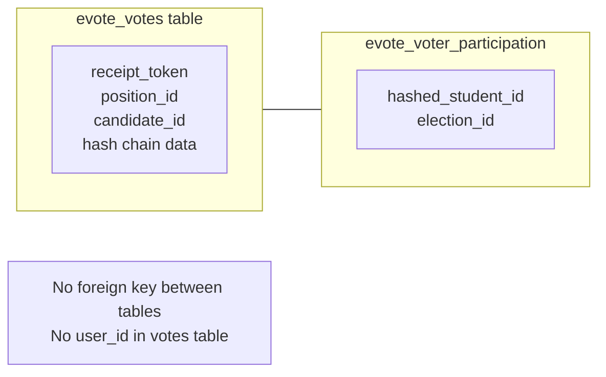
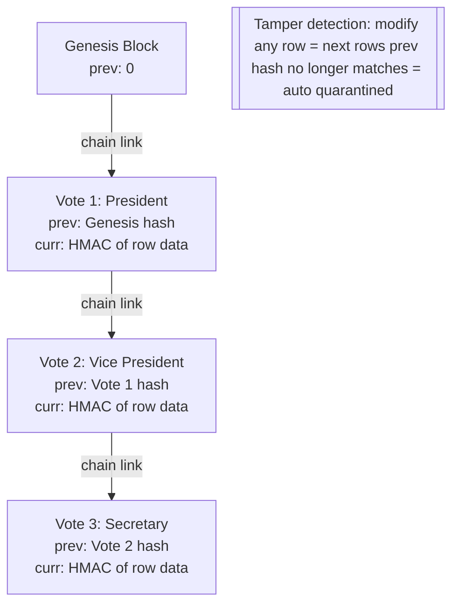
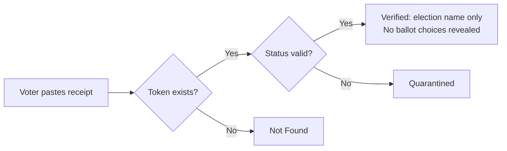

# Voting Architecture

## 1. Voter Flow

## 2. Anonymity Model

**Key:** The `hashed_student_id` prevents double-voting. The receipt token proves you voted — but only you hold it. No ID links your vote rows to your identity.

## 3. Hash Chain

Each vote row is hashed to the previous one via `HMAC-SHA256` with the app key. Break the chain, break the election.

## 4. Verify Vote

---

## How It Works

### The Voting Process

1. A student logs in and sees active elections on their dashboard
2. They click "Cast Your Vote" which opens a full-screen ballot
3. For each position (President, VP, Secretary), they select their candidate
4. They click "Continue" to move to the next position
5. On the last position, they click "Submit Ballot"
6. The system gives them a receipt token like `HTU-XXXX-XXXX-XXXX`
7. They can use this receipt later to verify their vote was counted

### What Happens Behind the Scenes

When a ballot is submitted, several things happen inside a single database transaction:

1. The system checks the hash chain for any previously tampered votes
2. It locks the election row so no other ballot can interfere
3. It reads the last valid vote's hash as the "previous hash"
4. For each candidate selected, it creates a vote row that links to the previous one
5. It records that the student has voted (using a hashed student ID)
6. It generates a unique receipt token and returns it to the voter

All of this happens atomically — either everything succeeds, or nothing is saved.

---

## Why the Hash Chain Matters

### The Problem It Solves

Imagine a traditional voting database:

| ID | Student | Position | Candidate |
|----|---------|----------|-----------|
| 1  | Julius  | President | Alice     |
| 2  | Sarah   | President | Bob       |

If someone with database access changes Julius's vote from Alice to Bob, there is **no way to detect the change**. The vote count changes and nobody knows.

### How Our Hash Chain Works

Every vote row contains two hashes that link it to the previous row:

| ID | Position | Candidate | Previous Hash | Current Hash |
|----|----------|-----------|---------------|--------------|
| 1  | President | Alice | `a1b2...` (from Genesis) | `c3d4...` |
| 2  | VP | Bob | `c3d4...` (matches row 1) | `e5f6...` |

The current hash is computed by: `HMAC-SHA256(receipt_token + candidate_id + previous_hash, APP_KEY)`.

If someone changes the candidate in row 1 from Alice to Bob, the current hash of row 1 no longer matches (because the candidate_id changed). And row 2's previous hash no longer matches row 1's current hash (because row 1's hash changed too). The entire chain breaks.

### What Happens When Tampering Is Detected

- The tampered row is automatically quarantined (status changes from `valid` to `quarantined`)
- If 20 or more votes are quarantined, the entire election is paused for review
- Administrators see the broken chain on the Audit page
- The system logs every quarantine event

### Why It's Necessary for E-Voting

- **Trust:** Voters can verify their vote without trusting the server
- **Detection:** Any tampering is immediately visible — no silent vote flipping
- **Recovery:** Quarantined votes are flagged, not deleted — administrators can investigate
- **Defense:** Even with direct database access, modifying votes breaks the chain and is detected

---

## Scenarios the System Handles

### Scenario 1: Direct Database Tampering

An attacker with database access changes a candidate_id in the votes table. The system detects the broken hash link on the next ballot submission. The tampered row is quarantined. Administrators are alerted.
**Result:** Attack detected, vote integrity preserved.

### Scenario 2: Double Voting

A student tries to vote twice in the same election. The system checks `evote_voter_participation` before accepting the ballot. The unique constraint on `(election_id, hashed_student_id)` blocks the second attempt.
**Result:** One vote per student, enforced at the database level.

### Scenario 3: Concurrent Voting

Two students submit ballots at the exact same time. The database transaction locks the election row. Only one ballot processes at a time. Each gets a unique chain position.
**Result:** No forked chains, consistent vote ordering.

### Scenario 4: Receipt Verification

A voter wants to prove their vote was counted. They paste their receipt token on the verify page. The system confirms the vote exists in the chain without revealing who they voted for.
**Result:** Trust without compromising anonymity.

### Scenario 5: Admin Audit

After an election, administrators run a chain audit. The system validates every hash link. Broken links are flagged. A health status (valid/broken) is displayed with quarantine counts.
**Result:** Transparent, verifiable election integrity.
